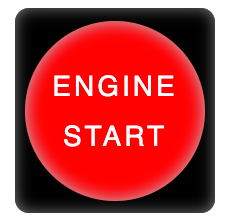
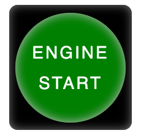
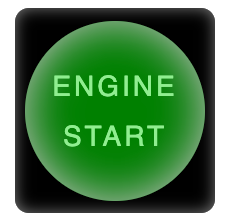

# Engine-Start-Button

A dynamic user interface designed to simulate a Engine Start Button. Written in CSS the user is prompted to interact with the button that returns graphical and audio responses.

## Screenshots

Normal

Hover

Active

